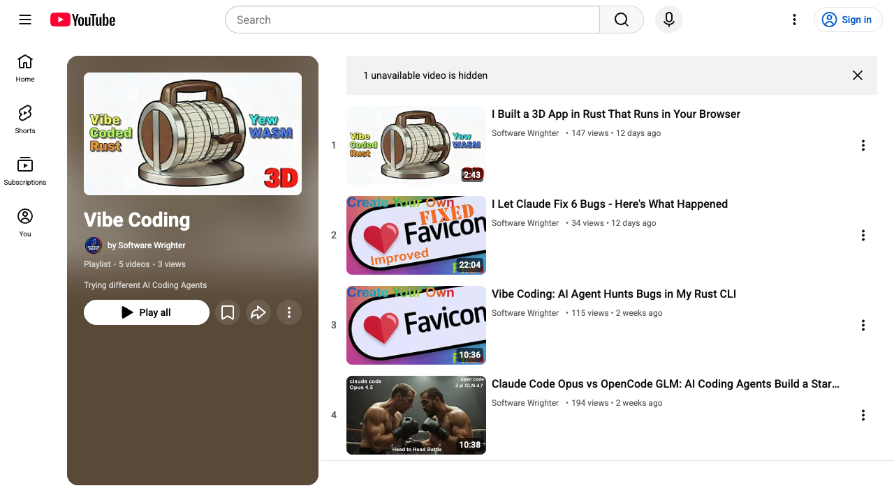

# Rolodex

A 3D rolodex contact management application built with Rust/Yew and Three.js.


## Live Demo

[Try the Live Demo](https://softwarewrighter.github.io/rolodex/?ts=1766972028000)

## Features

- 3D rotating rolodex visualization using Three.js
- Add, edit, and delete contact cards
- Search contacts by name, company, email, or phone
- Alphabetically sorted contact list
- Click cards in 3D view to edit
- Touchpad/scroll wheel navigation
- Local storage persistence
- Populate with fake test data (100 cards)

## Technology Stack

- **Frontend**: Rust/Yew (WebAssembly)
- **3D Visualization**: Three.js
- **Build Tool**: Trunk
- **Storage**: Browser LocalStorage

## Development

### Prerequisites

- Rust (latest stable)
- wasm-pack
- trunk (`cargo install trunk`)

### Build

```bash
./scripts/build.sh
```

### Serve Locally

```bash
./scripts/serve.sh
```

### Deploy

```bash
./scripts/deploy.sh
```

## Documentation

- [Architecture](documentation/architecture.md) - Technical architecture and system design
- [PRD](documentation/prd.md) - Product Requirements Document
- [Design](documentation/design.md) - UI/UX design decisions
- [Plan](documentation/plan.md) - Development roadmap and milestones
- [Status](documentation/status.md) - Current project status
- [Development Process](documentation/process.md) - Development workflow
- [Development Tools](documentation/tools.md) - Recommended tools

## Video Demo

[](https://www.youtube.com/playlist?list=PLKjvVAEaR4isvF2r_L4j9ycYHJ1KUL00J)

[I Built a 3D App in Rust That Runs in Your Browser](https://www.youtube.com/watch?v=uyjDtYSpyvg)

## License

MIT License - Copyright 2025 Software Wrighter
